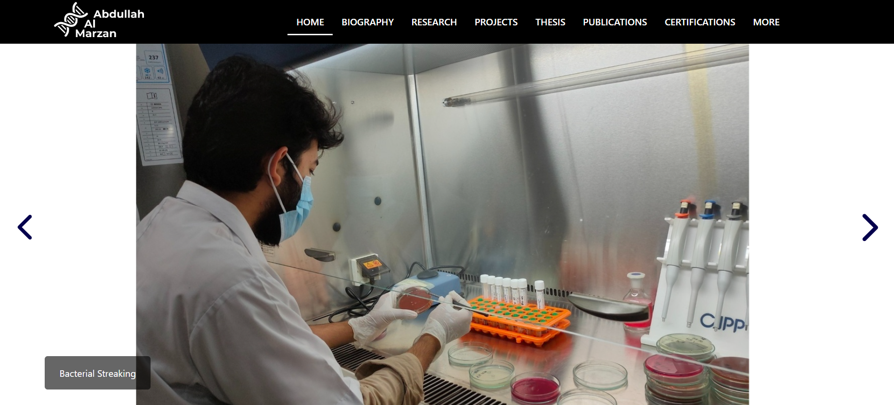

# Abdullah Al Marzan | Professional Portfolio

This repository contains the complete source code for the professional portfolio of Abdullah Al Marzan, a Molecular Biologist and Bioinformatician.

**Live Website:** **[https://www.aamarzan.com/](https://www.aamarzan.com/)**

---

### About This Project

This website was built from scratch using pure HTML, CSS, and JavaScript to serve as a comprehensive, dynamic, and professional online presence. It showcases my academic background, research projects (ongoing and previous), publications, and skills in a clean, user-friendly, and fully responsive format. The goal was to create a central, high-performance hub for my professional and academic work.

### Tech Stack & Features

* **Core:** HTML5, CSS3 (Flexbox & Grid), JavaScript (ES6)
* **Hosting & Deployment:** Deployed on **Netlify** with a custom domain, with source code version-controlled on **GitHub**.
* **Performance:** Optimized images, clean URLs (`/about/`), and a sitemap submitted to Google Search Console for professional SEO.
* **User Experience (UX):**
    * Fully responsive design for all devices, from mobile to desktop.
    * Premium "fade and slide up" animations on page scroll.
    * An elegant, multi-stage welcome animation for first-time visitors.
    * Interactive elements, including a dynamic certificate gallery and video players.
    * A functional Progressive Web App (PWA) that can be "installed" on a user's home screen.

### Connect with Me

- **LinkedIn:** [linkedin.com/in/abdullah-al-marzan-896a43187](https://www.linkedin.com/in/abdullah-al-marzan-896a43187/)
- **Google Scholar:** [scholar.google.com/citations?user=Xvc4eokAAAAJ](https://scholar.google.com/citations?hl=en&user=Xvc4eokAAAAJ)
- **ResearchGate:** [researchgate.net/profile/Abdullah-Marzan](https://www.researchgate.net/profile/Abdullah-Marzan)
- **GitHub:** [github.com/abdullah-al-marzan](https://github.com/abdullah-al-marzan)
- **Email:** [marzansust16@gmail.com](mailto:marzansust16@gmail.com)
